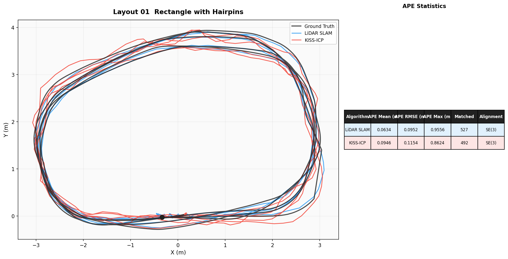

# tum_plotter

A lightweight CLI tool for visualising and comparing SLAM trajectories from TUM format files. Produces publication-ready plots with APE statistics, useful for anyone evaluating localisation algorithms.

## Features

- Plot single or multiple trajectories on the same 2D/3D axes
- Automatic trajectory alignment against ground truth (SE(3) or Sim(3))
- APE statistics table embedded in the plot
- APE error over time plot
- Scale correction for monocular visual SLAM (Sim(3) alignment)
- Publication-ready output (PDF, PNG, SVG)
- Only requires numpy and matplotlib, no ROS2 needed

## Installation

    git clone https://github.com/vader-droid33/tum_plotter.git
    cd tum_plotter
    pip install -e .

## Usage

    # Plot a single trajectory
    tum_plotter trajectory.tum

    # Compare multiple algorithms against ground truth
    tum_plotter --gt ground_truth.tum \
                --traj lidarslam.tum kiss_icp.tum odometry.tum \
                --labels "LiDAR SLAM" "KISS-ICP" "Odometry"

    # With scale correction for monocular visual SLAM
    tum_plotter --gt ground_truth.tum \
                --traj stella_vslam.tum \
                --labels "Stella-VSLAM" \
                --correct-scale

    # Save publication-ready PDF
    tum_plotter --gt ground_truth.tum \
                --traj lidarslam.tum kiss_icp.tum \
                --labels "LiDAR SLAM" "KISS-ICP" \
                --save comparison.pdf --no-show

    # 3D trajectory plot
    tum_plotter --gt ground_truth.tum --traj slam.tum --3d

    # APE error over time
    tum_plotter --gt ground_truth.tum --traj slam.tum --mode ape-time

## TUM Format

Each line: `timestamp x y z qx qy qz qw`

    1774444522.589 -0.352 -0.006 0.199 0.003 0.001 0.026 -0.999
    1774444522.608 -0.351 -0.006 0.199 0.003 0.001 0.026 -0.999

## Alignment Methods

    --correct-scale    Sim(3) , 7DOF (translation + rotation + scale)
                       Use for monocular visual SLAM (scale is ambiguous)

    (default)          SE(3) , 6DOF (translation + rotation, scale fixed at 1.0)
                       Use for LiDAR SLAM and metric-scale algorithms

## Python API

    from tum_plotter import load_tum, associate, align_umeyama, compute_ape
    import numpy as np

    t_est, xyz_est = load_tum("slam.tum")
    t_gt,  xyz_gt  = load_tum("ground_truth.tum")

    est_m, gt_m = associate(t_est, xyz_est, t_gt, xyz_gt, max_diff=0.5)
    aligned     = align_umeyama(est_m, gt_m, correct_scale=False)
    errors      = compute_ape(aligned, gt_m)

    print(f"APE Mean: {errors.mean():.4f}m")
    print(f"APE RMSE: {np.sqrt(np.mean(errors**2)):.4f}m")

## Compatibility

- Python 3.8+
- numpy, matplotlib
- Works with any TUM trajectory file (ROS2, ORB-SLAM3, KISS-ICP, Stella-VSLAM, etc.)

## License

MIT
